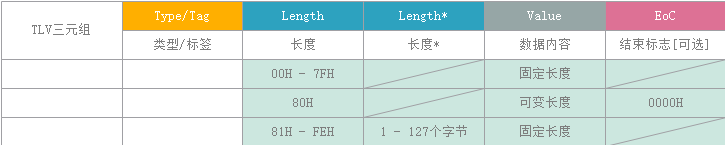
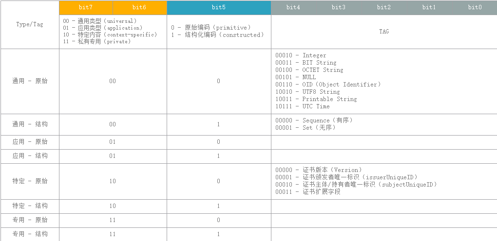

# ASN.1

- 抽象语法标记（`Abstract Syntax Notation One`）
- 描述了一种对数据进行表示、编码、传输和解码的数据格式

## 编码规则

- 基本编码规则（`BER` - Basic Encoding Rules）`TLV`三元组（`Type/Tag` `Length` `Value`）
- 规范编码规则（`CER` - Canonical Encoding Rules）`BER`的子集，针对不定长格式
- 唯一编码规则（`DER` - Distinguished Encoding Rules）`BER`的子集，针对定长格式，可辨别编码规则
- 压缩编码规则（`PER` - Packed Encoding Rules）
- XML编码规则（`XER` - XML Encoding Rules）

## 数据类型

### 简单类型

- `NULL` 空值
- `INTEGER` 整数
- `REAL` 实数（浮点数）`PLUS-INFINITY`（正无穷大）`MINUS-INFINITY`（负无穷大）
- `ENUMERATED` 枚举
- `BIT STRING` 比特串（比特数可以不是8的整数倍）
- `OCTET STRING` 字节串（比特数是8的整数倍）
- `OBJECT IDENTIFIER` 对象标识
- `RELATIVE-OID` 对象标识（OID按开放系统互连标准化命名并注册）
- `EXTERNAL`、`EMBEDDED PDV` 表示层上下文交换类型
- `CHARACTER STRING` 允许为字符串协商一个明确的字符表
- `UTCTime`、`GeneralizedTime` 日期

xString 除BIT、OCTET外的其他各种字符串，如：

- `NumericString`
- `PrintableString`
- `VisibleString`
- `IA5String`
- `ISO64String`
- `T61String`
- `UTF8String`
- `BMPString`
- `TeletexString`
- `VideotexString`
- `GraphicString`
- `GeneralString`
- `UniversalString`

### 构造类型

- `SEQUENCE` 有序、元素可不同类型（as struct）
- `SEQUENCE OF` 有序、元素须同类型（as array[]）
- `SET` 无序、元素可不同类型（as struct）
- `SET OF` 无序、元素须同类型（as array[]）

### 其他类型

- `CHOICE` 选择项集合、元素可不同类型，元素中择其一（as enum）
- `ANY` 任意数据

## 类型定义（`typereference ::= Type`）

```text
Counter ::= INTEGER
```

```text
UserAccount ::= SEQUENCE {
    username PrintableString,
    password PrintableString,
    account INTEGER
}
```

## 对象赋值（`valuereference Type ::= Value`）

```text
current Counter ::= 1234
```

```text
myAccount UserAccount ::= {
    username "tly",
    password "guesswhat",
    account 2345
}
```

## 标签类型

### 隐式标签类型（`[[class] number] IMPLICIT Type`）

- 在其它类型基础上通过改变其下层类型的标签而生成的
- 直接修改`TLV`中的`T`值

### 显式标签类型（`[[class] number] EXPLICIT Type`）

- 在其他类型基础上通过在其下层类型的标签之外添加一个外层标签而生成的
- 在`TLV`外再封装一层`TLV`

### 标签类型说明

- class 取值 `UNIVERSAL`（00b）、`APPLICATION`（01b）、`CONTEXT-SPECIFIC`（10b）、`PRIVATE`（11b）
- class 为可选项，未指定时默认为`CONTEXT-SPECIFIC`，该类型只能用于`SEQUENCE`、`SET`、`CHOICE`类型组件中
- number 为TLV三元组`Type/Tag`中b[4-0]取值`Tag number`
- Type 为数据类型，其编码将根据`class number`被重新局部定义

```text
PrivateKeyInfo ::= SEQUENCE { 
    version Version, 
    privateKeyAlgorithm PrivateKeyAlgorithmIdentifier, 
    privateKey PrivateKey, 
    attributes [0] IMPLICIT Attributes OPTIONAL
}
```

attributes此时被局部调整`Type/Tag`值为`10 x 00000b`

```text
ContentInfo ::= SEQUENCE { 
  contentType ContentType,
  content [0] EXPLICIT ANY DEFINED BY contentType OPTIONAL
}
```

content此时被局部调整TLV层级深度增加1层

## BER编码

### 编码结构（两种命名）

- `ILC`三元组（`Identifier`指示器、`Length`长度、`Content`内容）
- `TLV`三元组（`Type/Tag`类型标签、`Length`长度、`Value`赋值）




### Type/Tag编码格式

1. 一般单字节 `xx y ttttt` 8bits
2. 扩展多字节 `xx y 11111 1ttttttt ... 0ttttttt` 一般情况不用，预留扩展

- 标签分类（xx）`00`通用类、`01`应用类、`10`上下文特定类、`11`私有专用类
- 编码类型（y）`0`原始编码、`1`结构化编码
- `TAG number` <= 30 格式采用一般单字节，由b[4-0]表示
- `TAG number` >30 格式采用扩展多字节，由首字节b[4-0]全1+中间字节b[6-0]+尾字节b[6-0]组合表示

### Length编码格式

1. 一般单字节 `0 xxx xxxx` 取值<80H，内容长度确定且<=127字节
2. 特殊单字节 `1 000 0000` 取值=80H，内容长度不确定，由`EoC`结束标志（两字节00H）表明内容结束
3. 扩展多字节 `1 xxx xxxx yyyy ... yyyy` 取值>80H，由X指明实际内容长度域Y的字节数，内容长度确定且>127字节

### Value编码格式

1. 简单类型、定长（原始编码）
2. 结构类型、定长（结构化编码）`T L V ... T L V`
3. 结构类型、不定长（结构化编码）`T L V ... T L V ... T(00H) L(00H)` 由`EoC`结束标志（两字节00H）表明内容结束

- 原始编码（primitive）对简单类型进行编码，如：Integer、BIT String、OCTET String、OBJECT Identifier、UTC Time等
- 结构化编码（constructed）对结构类型进行编码，如：SEQUENCE、SEQUENCE OF、SET、SET OF、CHOICE等

### BER编码示例

- 布尔值（BOOLEAN）:`FALSE`（0）、`TRUE`（非0）

```text
T(01H) L(01H) V(00H) -- FALSE
T(01H) L(01H) V(01H~FFH) -- TRUE
```

- 空值（NULL）

```text
T(05H) L(00H) V(无)
```

- 整数

```text
sum INTEGER ::= 49

T(02H) L(01H) V(31H)
```

- 结构化数据

```text
UserAccount ::= SEQUENCE{
    username IA5String,
    account INTEGER
}

myAccount UserAccount ::={
username "john",
account 129
}

T(30H) L(0AH) V( T(16H) L(04H) V(4A6F686E) T(02H) L(02H) V(0081H) )
```

## DER编码

- DER 是 BER 的子集，它定义了使用一个 octet string 来表示任何 ASN.1 值的编码方法

### 在BER基础上增加的限制

- 内容长度在0~127之间，必须使用短型长度表示法
- 内容长度大于等于128，必须使用长型长度表示法，并且长度必须使用尽可能少的字节表示
- 对于简单 string 类型和在其基础上使用隐式标签生成的类型，必须使用简单定长编码方法
- 对于结构化类型和在其基础上使用隐式标签生成的类型，必须使用结构化定长编码方法
- 对于在任何类型基础上使用显式标签生成的类型，必须使用结构化定长编码方法
