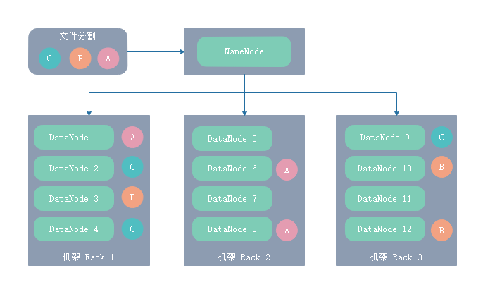

# apache-hadoop-arch

## MapReduce

- 分布式计算框架
- Map（任务拆分，数据整理转化为key-value型数据）
- Reduce（处理结果汇总）

### 计算过程（多次读写HDFS文件系统）

- (input)<k1,v1> => map => <k2,v2> => combine => <k2,v2> => reduce => <k3,v3>(output)
- 1.输入数据
- 2.Map将数据转化为key-value型数据
- 3.各节点分布式计算
- 4.Reduce将分布式计算结果进行汇总归集
- 5.输出数据

## YARN

- 资源管理及任务调度（Yet Another Resource Negotiator，另一种资源协调者）
- ResourceManager（单节点）
- NodeManager（多节点）

## HDFS

- 分布式文件系统（Hadoop Distributed File System）
- NameNode（单节点）
- DataNode（多节点）
- SecondaryNameNode（仅对NameNode进行旁路备份，当NameNode单点故障时不能接替其工作）

### 文件存储架构



## 应用开发

```sh
# 步骤1：基于MapReduce框架开发Java等语言的应用程序
# 步骤2：将应用制作成JAR包
# 步骤3：运行应用
hadoop jar xxx.jar 主类名 HDFS输入文件 HDFS输出文件
```

## HDFS集群

### HDFS-Master主节点（1个）

- NameNode（内存文件系统、抽象目录树、文件按块切分、单点故障、消耗内存资源）
- SecondaryNameNode（文件系统辅助旁路备份机制、不能取代NameNode、配置磁盘资源；理论上应单独部署节点）

### HDFS-Slave从节点（N个）

- DataNode（分布式数据块存储、同一数据块可在不同节点上多副本存储以避免单点故障、消耗磁盘资源）

## YARN集群

### YARN-Master主节点（1个）

- ResourceManager（集群资源管理）

### YARN-Slave从节点（N个）

- NodeManager（任务处理）

## 集群示例

```sh
# 机架（RAC.1）
# 节点（NODE.1）172.16.10.21 NameNode、ResourceManager
# 节点（NODE.2）172.16.10.22 DataNode、NodeManager

# 机架（RAC.2）
# 节点（NODE.3）172.16.10.23 DataNode、NodeManager
# 节点（NODE.4）172.16.10.24 DataNode、NodeManager
# 节点（NODE.5）172.16.10.25 SecondaryNameNode
```
