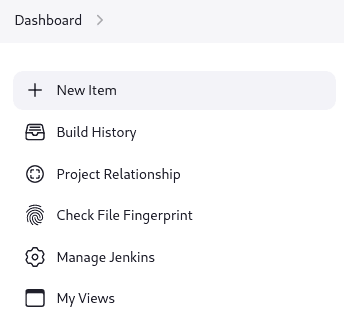

# Jenkins Manage

Most standard administrative tasks can be performed from the screens in the `Manage Jenkins` section of the `dashboard`.



## System Configuration group

### `System`

Configure global settings and paths for the Jenkins controller

### `Tools`（Ant、Git、JDK、Maven）

Configure tools, their locations, and automatic installers

### `Plugins`

Add, update, remove, disable/enable plugins that extend the functionality of Jenkins.

### `Nodes and Clouds`

Add, remove, control, and monitor the nodes used for the agents on which build jobs run.

```sh
# 除通过UI配置外，可在任意主机上执行以下命令成为节点
java -jar agent.jar -url <Jenkins_URL> -secret <secret_key> -name <agent_name>
```

### `Configuration as Code`

Configure your Jenkins controller using a human-readable YAML file rather than the UI. This is an optional feature that appears in this group only when the plugin is installed on your controller.

## Security group

### `Security`

Set configuration parameters that secure your Jenkins controller.

### `Manage Credentials`

Configure the credentials that provide secure access to third-party sites and applications that interact with Jenkins.

### `Credential Providers`

Configure credential providers and types

### `Users`

Manage users defined in the Jenkins user database. This is not used if you use a different security realm such as LDAP or AD.

## Status Information group

### `System Information`

Displays information about the Jenkins environment.

### `System Log`

Jenkins log that contains all java.util.logging output related to Jenkins.

### `Load Statistics`

Displays information about resource utilization on you Jenkins controller.

### `About Jenkins`

Provides version and license information for your Jenkins controller.

## Troubleshooting group

### `Manage Old Data`

Remove configuration information related to plugins that have been removed from the controller.

## Tools and Actions group

Screens for common management tasks and management tools that enable you to do administrative tasks without using the UI.

### `Reload Configuration from Disk`

Discard all data that is loaded in memory and reload everything from the file system. This is useful when you modify configuration files directly on disk.

### `Jenkins CLI`

How to use the Jenkins CLI from a shell or script.

### `Script Console`

Execute an Apache Groovy script for administration, troubleshooting, and diagnostics.

### `Prepare for Shutdown`

Prevents new builds from starting so that the system can be shut down safely. Displays a red banner with a custom message so that users know what is about to happen.

## Uncategorized group

Screens for plugins that have not yet declared the category of their page.
