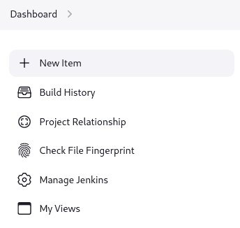

# Jenkins Pipeline

## Concept（概念）

- pipeline（流水线）
- node（节点）machine which is capable of executing a pipeline
- stage（阶段）subset of tasks
- step（步骤）task

## Jenkinsfile（控制文件）

```groovy
#!/usr/bin/env groovy
pipeline {
    agent any
    stages {
        stage('Build') {
            steps {
                sh 'make'
            }
        }
        stage('Test') {
            steps {
                sh 'make check'
                junit 'reports/**/*.xml'
            }
        }
        stage('Deploy') {
            steps {
                sh 'make publish'
            }
        }
    }
}
```

## Defining a Pipeline（三种方式）

### Through Blue Ocean

- 插件管理中输入`blue ocean`检索并安装`Blue Ocean`插件（默认未安装）
- 流水线可视化工具（pipeline visualization）


### Through the classic UI（经典UI）适用于简单流水线

- 新建流水线



- 选择流水线类型（会以所填名称创建目录，应避免空格及其他特殊字符）


- 流水线配置


- 流水线构建


- 流水线构建过程和状态监控


### In SCM（代码仓库）适用于复杂流水线

- 手动编写`Jenkinsfile`文件提交到代码仓库
- 流水线配置时`Definition`选择`Pipeline script from SCM`
