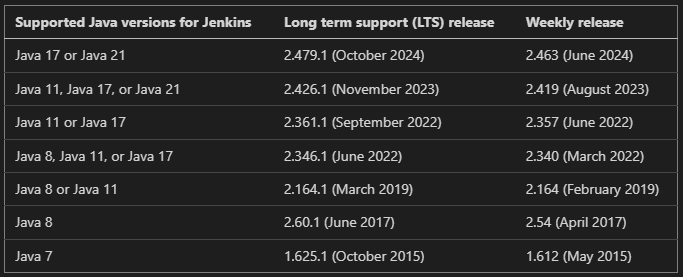

# jenkins

## Java version Required



## WAR file

The Jenkins Web application ARchive (WAR) file bundles `Winstone`, a `Jetty` servlet container wrapper, and can be started on any operating system or platform with a version of Java supported by Jenkins.

### download

```sh
# latest LTS
wget https://mirrors.tuna.tsinghua.edu.cn/jenkins/war-stable/2.492.3/jenkins.war
```

### pre-install

```sh
yum install -y fontconfig
```

### run the war file

```sh
# default 8080
java -jar jenkins.war --httpPort=8080

# change store config and data dir, default is $USER_HOME/.jenkins/
JENKINS_HOME=/var/lib/jenkins java -jar jenkins.war
```

### unlock jenkins

- Browse to `http://localhost:8080`
- When first access a new Jenkins controller, need to unlock it using an automatically-generated password.

### customizing jenkis with plugins

Click one of the two options shown:

- `Install suggested plugins` - to install the recommended set of plugins, which are based on most common use cases.
- `Select plugins to install` - to choose which set of plugins to initially install. When you first access the plugin selection page, the suggested plugins are selected by default.

### creating the first administration user

- admin/admin123
