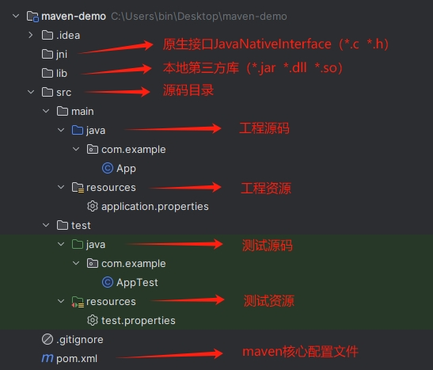

# apache-maven

Java开发的基于项目对象模型（`POM`）的项目管理工具，可完成项目的自动化构建（编译->部署）。

```sh
# Maven版本示例
MAVEN_VERSION=3.6.3
```

## 下载安装

```sh
tar -xzvf apache-maven-${MAVEN_VERSION}-bin.tar.gz -C /usr/local
ln -s /usr/local/apache-maven-${MAVEN_VERSION} /usr/local/maven
```

windows下解压到任意目录下（例：D:\apache-maven-%MAVEN_VERSION%）

## 环境变量（`MAVEN_HOME`、`PATH`）

```sh
# /etc/profile
export MAVEN_HOME=/usr/local/maven
export PATH=$PATH:$MAVEN_HOME/bin
```

```sh
source /etc/profile
```

windows下环境变量添加`MAVEN_HOME`，然后为`Path`环境变量添加`%MAVEN_HOME%\bin`子项

## Maven仓库

### 本地仓库

由配置文件`$MAVEN_HOME/conf/settings.xml`中参数`localRepository`进行设定

- 默认本地仓库（windows）`%user.home%\.m2\repository`
- 默认本地仓库（linux）`/home/user/.m2/repository`

```xml
<localRepository>D:/.m2/repository</localRepository>
<localRepository>/home/maven/.m2/repository</localRepository>
```

### 中央仓库/远程仓库

由配置文件`$MAVEN_HOME/conf/settings.xml`中参数`mirror`进行设定

- 默认中央仓库（maven）`http://repo1.maven.org/maven2`

```xml
<mirrors>
    <!-- 阿里云中央仓库 -->
    <mirror>
        <id>alimaven</id>
        <name>aliyun maven</name>
        <url>https://maven.aliyun.com/nexus/content/groups/public/</url>
        <mirrorOf>central</mirrorOf>
    </mirror>
    <!-- 自建私有仓库 -->
    <mirror>
        <id>my-maven-repo</id>
        <name>private maven repo</name>
        <url>http://my-domain-or-ip/public/</url>
        <mirrorOf>central</mirrorOf>
        <!-- 新版本出于安全考虑默认拦截http协议的仓库，设置blocked=false不拦截 -->
        <blocked>false</blocked>
    </mirror>
</mirrors>
```

## 本地仓库初始化

```sh
# 生成本地仓库（.m2）目录
mvn -v
mvn help:system
```

## 用户配置

```sh
# 可将全局配置文件拷贝到本地仓库.m2目录下，然后按需修改参数配置
cp $MAVEN_HOME/conf/settings.xml /home/maven/.m2/settings.xml
```

## 项目工程目录结构（约定）



## POM文件

```xml
<project xmlns="http://maven.apache.org/POM/4.0.0" xmlns:xsi="http://www.w3.org/2001/XMLSchema-instance"
  xsi:schemaLocation="http://maven.apache.org/POM/4.0.0 http://maven.apache.org/xsd/maven-4.0.0.xsd">
  <modelVersion>4.0.0</modelVersion>

  <groupId>com.example</groupId><!--项目组号-->
  <artifactId>maven-demo</artifactId><!--项目号-->
  <version>1.0-SNAPSHOT</version><!--版本-->
  <packaging>jar</packaging><!--打包方式-->

  <name>maven-demo</name><!--项目名称-->
  <url>http://maven-demo.example.com</url><!--项目地址-->

  <!--属性定义-->
  <properties>
    <project.build.sourceEncoding>UTF-8</project.build.sourceEncoding>
    <!-- 定义属性 property -->
    <junit.version>3.8.1</junit.version>
  </properties>

  <!--项目依赖-->
  <dependencies>
    <dependency>
      <groupId>junit</groupId>
      <artifactId>junit</artifactId>
      <!-- 使用属性 ${property} -->
      <version>${junit.version}</version>
      <scope>test</scope>
    </dependency>
  </dependencies>
</project>
```

### POM中项目依赖范围

- compile 默认值，适用于所有阶段（开发、测试、部署、运行）
- provided 仅开发和测试阶段依赖
- runtime 仅测试和运行阶段依赖
- test 仅测试阶段依赖（不随项目发布）
- system 类似provided（需显式提供包含依赖的jar，Maven不会在仓库中查找它）

### POM中自定义构建名称

```xml
<project>
  <build>
    <finalName>maven-demo-app</finalName>
  </build>
</project>
```

### POM中自定义构建资源文件

非资源目录下的资源文件需进行配置才能被打包输出，否则会被忽略

- directory 指定资源文件目录
- targetPath 指定资源文件打包输出时的目标目录（可选，默认保持相对路径）
- include 指定需包含的资源文件
- exclude 指定要忽略的资源文件

```xml
<project>
  <build>
    <resources>
      <resource>
        <directory>src/main/java</directory>
        <includes>
          <include>**/*.xml</include>
        </includes>
        <excludes>
          <exclude>**/*.txt</exclude>
          <exclude>**/*.doc</exclude>
        </excludes>
      </resource>
    </resources>
  </build>
</project>
```

### POM中自定义构建插件

```xml
<project>
  <build>
    <pluginManagement>
      <plugins>
        <plugin><!-- clean 插件（清理target） -->
          <artifactId>maven-clean-plugin</artifactId>
          <version>3.1.0</version>
        </plugin>
        <plugin><!-- resources 插件（构建资源） -->
          <artifactId>maven-resources-plugin</artifactId>
          <version>3.0.2</version>
        </plugin>
        <plugin><!-- compiler 插件（编译源码） -->
          <artifactId>maven-compiler-plugin</artifactId>
          <version>3.8.0</version>
        </plugin>
        <plugin><!-- surefire 插件（测试阶段） -->
          <artifactId>maven-surefire-plugin</artifactId>
          <version>2.22.1</version>
        </plugin>
        <plugin><!-- war 插件（输出war包） -->
          <artifactId>maven-war-plugin</artifactId>
          <version>3.2.2</version>
        </plugin>
        <plugin><!-- install 插件（安装到本地仓库） -->
          <artifactId>maven-install-plugin</artifactId>
          <version>2.5.2</version>
        </plugin>
        <plugin><!-- deploy 插件（发布到远程仓库） -->
          <artifactId>maven-deploy-plugin</artifactId>
          <version>2.8.2</version>
        </plugin>
      </plugins>
    </pluginManagement>
  </build>
</project>
```

## 项目构建环节

- 清理（clean）
- 编译（compile）
- 测试（test）
- 报告（report）
- 打包（package）
- 安装（install）
- 发布（deploy）

## 项目构建常用命令

部分命令需在pom.xml文件所在目录下执行，自动下载依赖及插件等

```sh
# 清理（会删除之前编译生成的target目录）
mvn clean
# 编译
mvn compile
# 编译（测试代码）
mvn test-compile
# 测试
mvn test
# 打包（war，jar等）
mvn package
# 安装（加载到指定仓库）
mvn install
```
