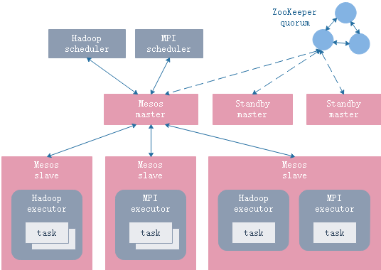

# apache-mesos

- 分布式资源管理框架
- 将物理机或虚拟机中的CPU、内存、磁盘等资源抽象出来

## 主从架构

- master
- slave : framework : { scheduler, executor }



## 下载安装

```sh
# 下载
wget http://www.apache.org/dist/mesos/1.7.0/mesos-1.7.0.tar.gz
# 解压
tar xzvf mesos-1.7.0.tar.gz
# 编译安装（须预先安装依赖工具，查阅官网说明）
mkdir build
cd build
../configure
make -j4
make install
```

## 配置

### mesos-master-env.sh

```sh
export MESOS_zk="zk://zoo1:2181,zoo2:2181,zoo3:2181/mesos" # ZooKeeper
export MESOS_quorum=2 # 法定选举数
export MESOS_work_dir=/var/lib/mesos
export MESOS_log_dir=/var/log/mesos
```

### mesos-slave-env.sh

```sh
export MESOS_master="zk://zoo1:2181,zoo2:2181,zoo3:2181/mesos" # ZooKeeper
export MESOS_work_dir=/var/lib/mesos
export MESOS_log_dir=/var/log/mesos
```

## 运行

```sh
mesos-master.sh --ip=127.0.0.1 --work_dir=/var/lib/mesos
mesos-agent.sh --master=127.0.0.1:5050 --work_dir=/var/lib/mesos
```

## 测试

```sh
http://127.0.0.1:5050
src/examples/java/test-framework 127.0.0.1:5050
```
